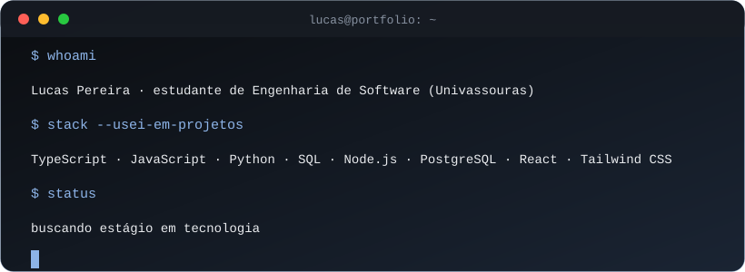
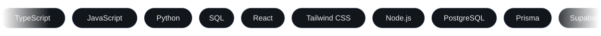

## Olá, eu sou o Lucas

Estudante de Engenharia de Software na Univassouras e desenvolvedor full stack em formação. Crio software para organizar, planejar e executar, e uso IA em automações para mim e para quem precisa de ajuda. Estou buscando estágio em tecnologia.

**[Portfólio](https://portifolio-nine-livid-23.vercel.app)** · **[LinkedIn](https://www.linkedin.com/in/lucaspds9/)** · **[E-mail](mailto:lucaspds9@hotmail.com)**

## Projetos

- **[LENS](https://lens-two-xi.vercel.app)** · sistema de produtividade que reúne hábitos com sequência, tarefas em quadro Kanban, rotina semanal, metas de 90 dias e um timer de foco, com gamificação. Uso para mim e quero abrir para outras pessoas.
  TypeScript, Prisma, PostgreSQL, NextAuth, Zustand, Tailwind CSS · [código](https://github.com/lucas04501/LENSAPP)
- **[Vire a Chave](https://vire-a-chave.vercel.app)** · e-book de autodesenvolvimento, escrito a partir de livros, hábitos e estudos de neurociência, com página própria de venda e pagamento pelo Kiwify. Em desenvolvimento: ligá-lo ao LENS.
- **[FlowFin](https://github.com/lucas04501/FlowFin)** · controle financeiro pessoal feito do zero, em desenvolvimento. Hoje: a base do back-end em Node.js, com Express e PostgreSQL.
- **[API de e-commerce](https://github.com/lucas04501/E-commerce)** · API de loja virtual em Python e Flask, em construção: login, CRUD de produtos e carrinho. Projeto de estudo.

Os detalhes de cada um estão no [portfólio](https://portifolio-nine-livid-23.vercel.app/#projetos).

## Tecnologias

**Já usei em projetos:** TypeScript, JavaScript, Python, SQL, HTML e CSS, React, Tailwind CSS, Node.js, PostgreSQL, Prisma, Supabase, Flask, Kiwify, Stripe, Git e GitHub, Vercel e ferramentas de IA (Claude e Gemini).

**Estudando:** C e Fastify.

## Formação

Bacharelado em Engenharia de Software, Univassouras (2026 a 2030, 2º período), e cursos da Rocketseat: Fundamentos de Desenvolvimento Web, Git e GitHub, Python com Flask, Introdução ao C e Fundamentos do React.

## GitHub em números

Dados públicos do GitHub, gerados por github-readme-stats e streak-stats.

## Contato

Escreva para [lucaspds9@hotmail.com](mailto:lucaspds9@hotmail.com) ou me encontre no [LinkedIn](https://www.linkedin.com/in/lucaspds9/). O [portfólio](https://portifolio-nine-livid-23.vercel.app/#contato) tem os mesmos contatos.
