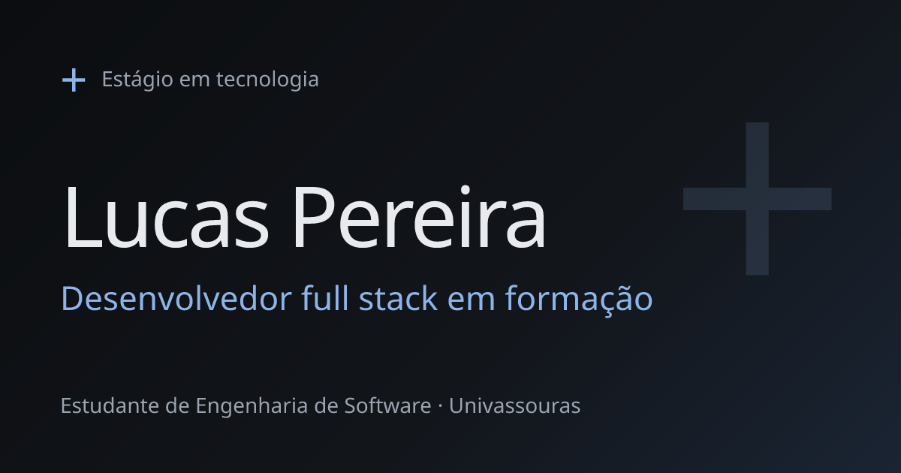

## Olá, eu sou o Lucas

Estudante de Engenharia de Software na Univassouras e desenvolvedor full stack em formação. Crio software para organizar, planejar e executar, e uso IA em automações para mim e para quem precisa de ajuda. Estou buscando estágio em tecnologia.

**[Portfólio](https://portifolio-nine-livid-23.vercel.app)** · **[LinkedIn](https://www.linkedin.com/in/lucaspds9/)** · **[E-mail](mailto:lucaspds9@hotmail.com)**

## Projetos

- **[LENS](https://lens-two-xi.vercel.app)** · sistema de produtividade que reúne hábitos com sequência, tarefas em quadro Kanban, rotina semanal, metas de 90 dias e um timer de foco, com gamificação. Uso para mim e quero abrir para outras pessoas.
  TypeScript, Prisma, PostgreSQL, NextAuth, Zustand, Tailwind CSS · [código](https://github.com/lucas04501/LENSAPP)
- **[Vire a Chave](https://vire-a-chave.vercel.app)** · e-book de autodesenvolvimento, escrito a partir de livros, hábitos e estudos de neurociência, com página própria de venda e pagamento pelo Kiwify. Em desenvolvimento: ligá-lo ao LENS.
- **[API de e-commerce](https://github.com/lucas04501/E-commerce)** · API em Python e Flask com login, catálogo, carrinho e finalização de compra, documentada com Swagger.

Os detalhes de cada um estão no [portfólio](https://portifolio-nine-livid-23.vercel.app/#projetos).

## Tecnologias

**Já usei em projetos:** TypeScript, JavaScript, Python, SQL, HTML e CSS, React, Tailwind CSS, Node.js, PostgreSQL, Prisma, Supabase, Flask, Kiwify, Stripe, Git e GitHub, Vercel e ferramentas de IA (Claude e Gemini).

**Estudando:** C e Fastify.

## Formação

Bacharelado em Engenharia de Software, Univassouras (2026 a 2030, 2º período), e cursos da Rocketseat: Fundamentos de Desenvolvimento Web, Git e GitHub, Python com Flask, Introdução ao C e Fundamentos do React.

## Contato

Escreva para [lucaspds9@hotmail.com](mailto:lucaspds9@hotmail.com) ou me encontre no [LinkedIn](https://www.linkedin.com/in/lucaspds9/).
